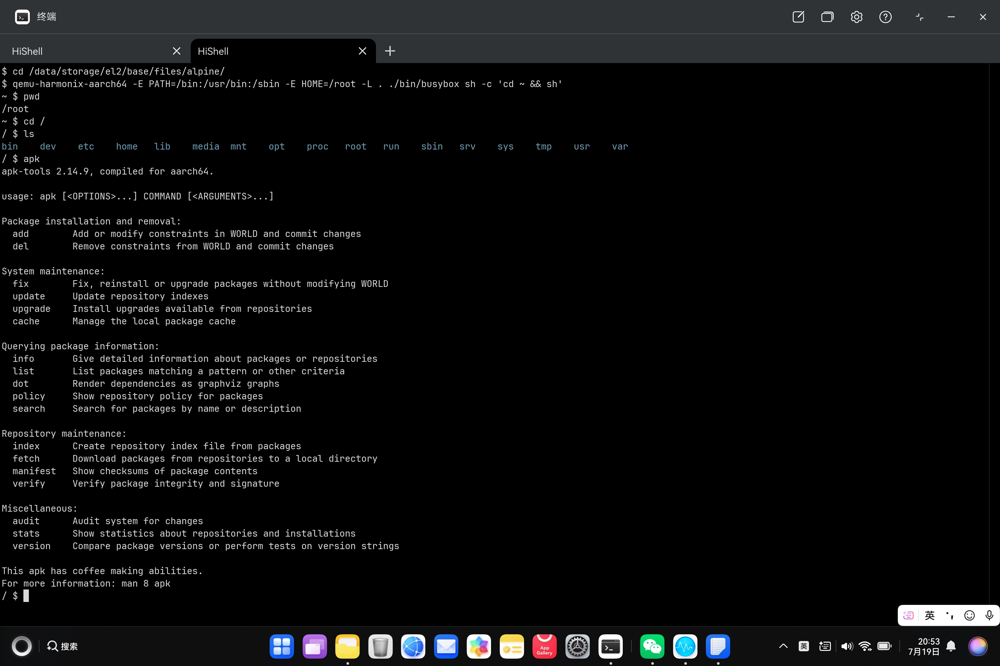
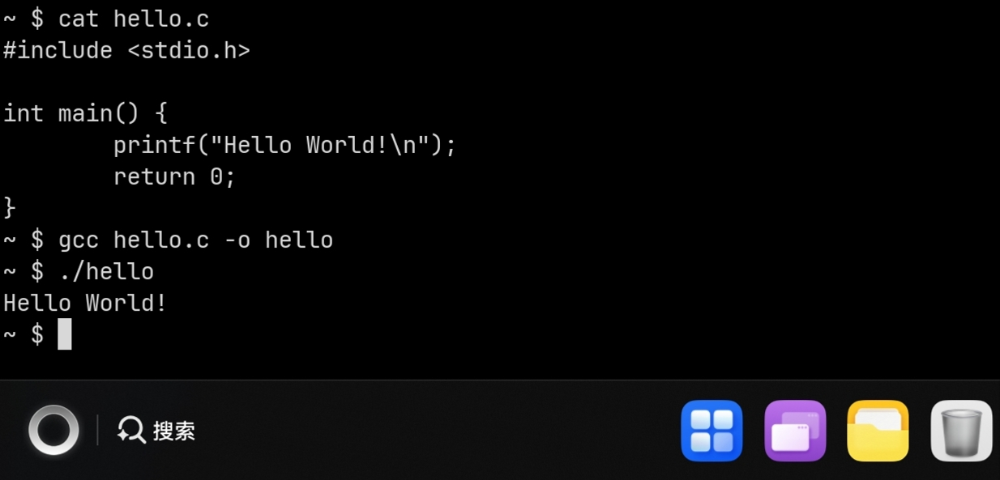

# Harmonix

Run linux elf binary (alpine rootfs also supported) on HarmonyOS PC, inspired by [Termony](https://github.com/TermonyHQ/Termony), based on [harmony-qemu](https://github.com/hackeris/harmony-qemu).

Originally for quick verification to integrate qemu-user to [Termony](https://github.com/TermonyHQ/Termony). 

Working in progress, in the early stages.



# Build

To build and install to your device, see [Build Termony on Linux](https://github.com/TermonyHQ/Termony?tab=readme-ov-file#usage-if-you-are-a-linux-user)

# Usage

- Install Harmonix to your HarmonyOS PC
- Download alpine minimal root filesystem from https://alpinelinux.org/downloads/ (aarch64 or x64)
- In HiShell, extract rootfs tar.gz file to data directory, for example `/data/storage/el2/base/files/alpine`
- Run qemu-harmonix-aarch64 to load busybox shell with rootfs and environment variables
```shell
cd /data/storage/el2/base/files/alpine
qemu-harmonix-aarch64 -E PATH=/bin:/usr/bin:/sbin -E HOME=/root -L ./ ./bin/busybox sh -c 'cd ~ && sh'
```
- cd to `/` and run `busybox ls`, the root changed!
```shell
cd /
ls
bin    dev    etc    home   lib    media  mnt    opt    proc   root   run    sbin   srv    sys    tmp    usr    var
```
- `apk` is also runnable
```shell
apk add gcc
```
- `gcc` can compile a `Hello World` to run
```shell
gcc hello.c -o hello
./hello
```


# Problems

There may be some problems, such as

- Some syscalls may not be relocated to rootfs
- Path may not be relocated as expected
- Hard link is not supported now
- Other problems
