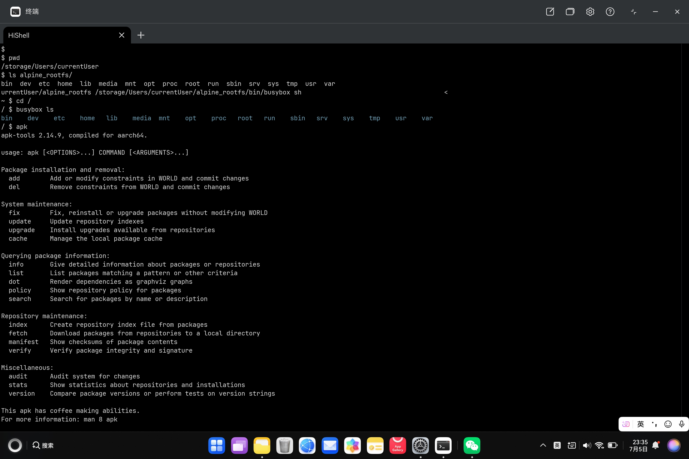

# Harmonix

Run linux rootfs (like alpine rootfs) on HarmonyOS PC, inspired by [Termony](https://github.com/TermonyHQ/Termony), based on [harmony-qemu](https://github.com/TermonyHQ/qemu).

Originally for quick researching to integrate qemu-user to [Termony](https://github.com/TermonyHQ/Termony). 

Just playable now. Working in progress, in the early stages.



# Build

To build and install to your device, see [Build Termony on Linux](https://github.com/TermonyHQ/Termony?tab=readme-ov-file#usage-if-you-are-a-linux-user)

# Usage

- Install Harmonix to your HarmonyOS PC
- Download alpine minimal root filesystem from https://alpinelinux.org/downloads/ (aarch64 or x64)
- Extract rootfs tar.gz file, for example, to `/storage/Users/currentUser/alpine_rootfs`
- Fix some missing soft links by cp
```
cd alpine_rootfs
cp bin/busybox bin/sh
cp lib/ld-musl-aarch64.so.1  lib/libc.musl-aarch64.so.1
cp usr/lib/libz.so.1.3.1 usr/lib/libz.so.1
```
- Run qemu-aarch64 to load busybox with rootfs and env vars
```
qemu-harmonix-aarch64 -E LD_LIBRARY_PATH=/lib:/usr/lib -E PATH=/bin:/usr/bin:/sbin -L /storage/Users/currentUser/alpine_rootfs /storage/Users/currentUser/alpine_rootfs/bin/busybox sh
```
- cd to `/` and run `busybox ls`, the root changed!
```
cd /
busybox ls
bin    dev    etc    home   lib    media  mnt    opt    proc   root   run    sbin   srv    sys    tmp    usr    var
```
- `apk` is also runnable

# Problems

There may be some problems, because of

- Not all path to syscall is relocated to rootfs
- Path may not be relocated as expected
- Soft link is not supported now
- Other problems
